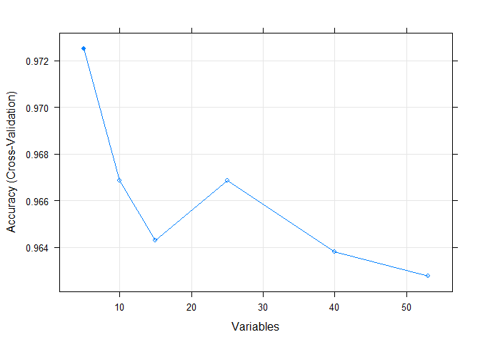
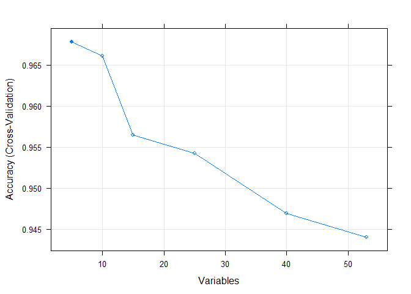

Practical Machine Learning Course Project: Weight Lifting prediction
================

Short description
-----------------

In this script I have used a specific approach for data exploration and clening and also a specific one for model selection, training, cross-validation and finally testing

### For data exploration the code analyses and cleans:

-   clean prediction related useless data columns such as index, person names, etc
-   clean **NA data predictor** variables
-   clean **empty data** predictor variables
-   near **zero variance predictor** variables
-   predictor **variables correlation** analysis (pair feature plot excluded for this case)
-   analyze **variables importance** based on Recursive Feature Elimination

### For model preparation, selection, cross-validationL

-   from initial training dataset three subsets are generated: training, cross-validation and testing
-   **optional** PCA is used to preprocess training data then PCA model is used to fit cross/testing
-   a **list** of models is used in a automated/iterrative process
-   each model is **cross** evaluated including running time

Code sections
-------------

setup caret and also parallel processing so we can use all cores in order to speed up all the heavy computing tasks:

``` r
avail_cores <- detectCores() 
p_cluster <- makeCluster(avail_cores)
registerDoParallel(p_cluster)
sprintf("Cores registered = %d",getDoParWorkers())
```

    ## [1] "Cores registered = 8"

LOADING AND CLEANING
--------------------

We have to identify current script working directory then load all data in data exploration dataframe `exploreData` and make a copy in `finalData` that will be used later for final cleaning process.

``` r
exploreData <- read.csv("pml-training.csv")
finalData <- data.frame(exploreData)
```

First lets do a quick analysis of zero variance predictors with `nearZeroVar(exploreData, saveMetrics = TRUE)`. We will display the total ammount of near-zero variance predictors and the head of the table containing them. We are going to maintain a list of `ALL DROPPED COLUMNS` in order to use it for the final test dataset pre-processing together with the PCA model if any.

    ## [1] "Total number of near-zero var preds = 60"

    ##                       freqRatio percentUnique zeroVar  nzv
    ## new_window             47.33005    0.01019264   FALSE TRUE
    ## kurtosis_yaw_belt      47.33005    0.01019264   FALSE TRUE
    ## skewness_yaw_belt      47.33005    0.01019264   FALSE TRUE
    ## kurtosis_yaw_dumbbell  47.33005    0.01019264   FALSE TRUE
    ## skewness_yaw_dumbbell  47.33005    0.01019264   FALSE TRUE
    ## kurtosis_yaw_forearm   47.33005    0.01019264   FALSE TRUE

Now it is bvious we have a lot of **cleaning** to do on data so we need to start the data exploration and cleanning process - first drop totally useless columns such as observation number, name and then start working on the NA columns, find if there are NA-only columns or columns with more than 95% NA, get na column indexes then finally get the actual column names and display them:

    ## [1] "Number of NA columns dropped = 67"

    ##  [1] "max_roll_belt"            "max_picth_belt"          
    ##  [3] "min_roll_belt"            "min_pitch_belt"          
    ##  [5] "amplitude_roll_belt"      "amplitude_pitch_belt"    
    ##  [7] "var_total_accel_belt"     "avg_roll_belt"           
    ##  [9] "stddev_roll_belt"         "var_roll_belt"           
    ## [11] "avg_pitch_belt"           "stddev_pitch_belt"       
    ## [13] "var_pitch_belt"           "avg_yaw_belt"            
    ## [15] "stddev_yaw_belt"          "var_yaw_belt"            
    ## [17] "var_accel_arm"            "avg_roll_arm"            
    ## [19] "stddev_roll_arm"          "var_roll_arm"            
    ## [21] "avg_pitch_arm"            "stddev_pitch_arm"        
    ## [23] "var_pitch_arm"            "avg_yaw_arm"             
    ## [25] "stddev_yaw_arm"           "var_yaw_arm"             
    ## [27] "max_roll_arm"             "max_picth_arm"           
    ## [29] "max_yaw_arm"              "min_roll_arm"            
    ## [31] "min_pitch_arm"            "min_yaw_arm"             
    ## [33] "amplitude_roll_arm"       "amplitude_pitch_arm"     
    ## [35] "amplitude_yaw_arm"        "max_roll_dumbbell"       
    ## [37] "max_picth_dumbbell"       "min_roll_dumbbell"       
    ## [39] "min_pitch_dumbbell"       "amplitude_roll_dumbbell" 
    ## [41] "amplitude_pitch_dumbbell" "var_accel_dumbbell"      
    ## [43] "avg_roll_dumbbell"        "stddev_roll_dumbbell"    
    ## [45] "var_roll_dumbbell"        "avg_pitch_dumbbell"      
    ## [47] "stddev_pitch_dumbbell"    "var_pitch_dumbbell"      
    ## [49] "avg_yaw_dumbbell"         "stddev_yaw_dumbbell"     
    ## [51] "var_yaw_dumbbell"         "max_roll_forearm"        
    ## [53] "max_picth_forearm"        "min_roll_forearm"        
    ## [55] "min_pitch_forearm"        "amplitude_roll_forearm"  
    ## [57] "amplitude_pitch_forearm"  "var_accel_forearm"       
    ## [59] "avg_roll_forearm"         "stddev_roll_forearm"     
    ## [61] "var_roll_forearm"         "avg_pitch_forearm"       
    ## [63] "stddev_pitch_forearm"     "var_pitch_forearm"       
    ## [65] "avg_yaw_forearm"          "stddev_yaw_forearm"      
    ## [67] "var_yaw_forearm"

Now get columns that are actually **empty** (actually similar to na - more than **95% empty**), display all of them and finally perform cleaning on dataset:

    ## [1] "Number of Empty columns dropped = 33"

    ##  [1] "kurtosis_roll_belt"      "kurtosis_picth_belt"    
    ##  [3] "kurtosis_yaw_belt"       "skewness_roll_belt"     
    ##  [5] "skewness_roll_belt.1"    "skewness_yaw_belt"      
    ##  [7] "max_yaw_belt"            "min_yaw_belt"           
    ##  [9] "amplitude_yaw_belt"      "kurtosis_roll_arm"      
    ## [11] "kurtosis_picth_arm"      "kurtosis_yaw_arm"       
    ## [13] "skewness_roll_arm"       "skewness_pitch_arm"     
    ## [15] "skewness_yaw_arm"        "kurtosis_roll_dumbbell" 
    ## [17] "kurtosis_picth_dumbbell" "kurtosis_yaw_dumbbell"  
    ## [19] "skewness_roll_dumbbell"  "skewness_pitch_dumbbell"
    ## [21] "skewness_yaw_dumbbell"   "max_yaw_dumbbell"       
    ## [23] "min_yaw_dumbbell"        "amplitude_yaw_dumbbell" 
    ## [25] "kurtosis_roll_forearm"   "kurtosis_picth_forearm" 
    ## [27] "kurtosis_yaw_forearm"    "skewness_roll_forearm"  
    ## [29] "skewness_pitch_forearm"  "skewness_yaw_forearm"   
    ## [31] "max_yaw_forearm"         "min_yaw_forearm"        
    ## [33] "amplitude_yaw_forearm"

### Predictors variance and correlation analysis

The next step in building our model, after basic cleaning is to analyze again the predictors variance using `nearZeroVar`. Then we will sort and display the predictors with least variance and also display all factor variables and their summary omiting the label `classe`. Finally we drop the factor variables with near-zero variance:

    ## [1] "Near zero variance:"

    ##                      freqRatio percentUnique zeroVar   nzv
    ## new_window           47.330049    0.01019264   FALSE  TRUE
    ## classe                1.469581    0.02548160   FALSE FALSE
    ## total_accel_belt      1.063160    0.14779329   FALSE FALSE
    ## total_accel_dumbbell  1.072634    0.21914178   FALSE FALSE
    ## total_accel_arm       1.024526    0.33635715   FALSE FALSE
    ## gyros_belt_y          1.144000    0.35164611   FALSE FALSE

    ## [1] "Factors variables:" "new_window"

    ##  new_window 
    ##  no :19216  
    ##  yes:  406

Variable correlation analysis
-----------------------------

Now analyze the predictor variables correlation in order determine if we have very high correlation. We do this by calculating correlation matrix with `cor(exploreData[,setdiff(colnames(exploreData),c("classe"))])` (excluding label `classe` column):

    ##  [1] "Highly correlated predictor variables:"
    ##  [2] "accel_belt_z"                          
    ##  [3] "roll_belt"                             
    ##  [4] "accel_belt_y"                          
    ##  [5] "accel_arm_y"                           
    ##  [6] "total_accel_belt"                      
    ##  [7] "accel_dumbbell_z"                      
    ##  [8] "accel_belt_x"                          
    ##  [9] "pitch_belt"                            
    ## [10] "magnet_dumbbell_x"                     
    ## [11] "accel_dumbbell_y"                      
    ## [12] "magnet_dumbbell_y"                     
    ## [13] "accel_arm_x"                           
    ## [14] "accel_dumbbell_x"                      
    ## [15] "accel_arm_z"                           
    ## [16] "magnet_arm_y"                          
    ## [17] "magnet_belt_z"                         
    ## [18] "accel_forearm_y"                       
    ## [19] "gyros_dumbbell_x"                      
    ## [20] "gyros_forearm_y"                       
    ## [21] "gyros_dumbbell_z"                      
    ## [22] "gyros_arm_x"

Due to high correlation between variable we might need to apply PCA later or use a feature selection method available in `caret` package

### Recursive Feature Elimination Step

Finally in data cleaning and pre-processing stage we analize the actual variables importance based on a trained model and obtain a automatic features selection model based on `rfe` available within `caret` package.We will get two samples of our data and then train two different `rfe` models based on random forests followed by plot view/analysis on both. First plot of number of features vs cross-validation accuracy:



And now the second plot of predictor variables quantity vs prediction accuracy:



Based on the two plots it is obvious that best number of predictors is between 5 and 12. Now we combine our findings in order to obtain a final list of predictor variables:

    ## [1] "FINAL PREDICTORS :" "roll_belt"          "num_window"        
    ## [4] "magnet_dumbbell_z"  "pitch_forearm"      "magnet_dumbbell_y"

TRAINING AND TESTING MODELS
---------------------------

Finally we can now prepare training, cross-validation and test datasets (training dataset 60%, crossval dataset 20%, testing dataset 20%), but first having the list of all `dropped_columns` we can either apply it to `finalData` or we could use the automated selection of predictor variables. Based on this, we have a few special meta-parameters for customizing our model: - `useAutomaticPredictors` controls if we use or not the short list of predictors generated by **Recursive Feature Elimination** - `usePCA` controls if we use or not dimensionality reduction preprocessing based on **Principal Components Analysis**

``` r
useAutomaticPredictors = TRUE
usePCA = FALSE

if (useAutomaticPredictors){
  good_columns <- c(final_predictors,c("classe"))
  pred_columns <- final_predictors 
}else{
  good_columns <- setdiff(colnames(finalData), dropped_columns)
  pred_columns <- setdiff(good_columns, c("classe"))
  
}

finalData <- finalData[good_columns]
inTraining <- createDataPartition(finalData$classe, p=0.6, list=FALSE)
trainingStd <- finalData[inTraining,]
testdataStd <- finalData[-inTraining,]
inVal <- createDataPartition(testdataStd$classe, p=0.5, list=FALSE)
crossvalStd <- testdataStd[inVal,]
testingStd <- testdataStd[-inVal,]
##
## Now the PCA pre-processing stage (if needed)
##
if (usePCA)
{
  PCA.model <- preProcess(trainingStd[pred_columns],method="pca", thresh=0.95)
  training <- predict(PCA.model, trainingStd)
  crossvalidation <- predict(PCA.model,crossvalStd )
  testing <- predict(PCA.model, testingStd)  
} else
{
  training <- trainingStd
  crossvalidation <- crossvalStd
  testing <- testingStd
}
```

Multi-model cross-validation testing
------------------------------------

Now I train several different models, analyze them and then and then choose the best model based on best cross validation score. So first stage is timed training for each proposed model and cross-validations. Keep all accuracy values in vectors then combine in dataframe to finally display.

``` r
All.Methods <- c("lda","rpart","knn","lvq","xgbTree")
nr_models <- length(All.Methods)
Cross.Accuracy <- c()
Training.Time <- c()
bestAccuracy <- 0 

for (c_model in 1:nr_models){
  
  methodName <-  All.Methods[c_model]
  print(paste0("Training ",methodName,"..."))
  tmr_start <- proc.time()
  curr.model <- train(classe ~ .,
                      data = training,
                      method = methodName)
  tmr_end <- proc.time()
  print(paste0("Done training ",methodName,"."))  
  Training.Time[c_model] = (tmr_end-tmr_start)[3]
  
  preds<- predict(curr.model,crossvalidation)

  cfm <- confusionMatrix(preds,crossvalStd$classe)
  Cross.Accuracy[c_model] <- cfm$overall['Accuracy']
  
  if(bestAccuracy < Cross.Accuracy[c_model]){
    best.model <- curr.model
    bestAccuracy <- Cross.Accuracy[c_model]
  }
  
}
```

    ## [1] "Training lda..."

    ## Loading required package: MASS

    ## [1] "Done training lda."
    ## [1] "Training rpart..."

    ## Loading required package: rpart

    ## [1] "Done training rpart."
    ## [1] "Training knn..."
    ## [1] "Done training knn."
    ## [1] "Training lvq..."

    ## Loading required package: class

    ## [1] "Done training lvq."
    ## [1] "Training xgbTree..."

    ## Loading required package: xgboost

    ## Loading required package: plyr

    ## [1] "Done training xgbTree."

And the custom constructed summary of the training and cross-validation process
-------------------------------------------------------------------------------

    ##   All.Methods Cross.Accuracy Training.Time
    ## 1         lda      0.3907724          0.91
    ## 4         lvq      0.5281672         46.55
    ## 2       rpart      0.5388733          1.28
    ## 3         knn      0.9548815          7.24
    ## 5     xgbTree      0.9994902        175.94

### Alllmost there !

Now that we have our final model lets apply it on testing dataset and then display confusion matrix so we can visually compare test result with previous cross validation one. We could also use a random forest or other classifier to ensemble to 2 or 3 predictors. Nevertheless this is not needed for this particular exercise as top two predictors achieved over 95% accuracy with the best one constantly over 99% with a out-of-sample error rate of under 1% based on cross-validation dataset (used for all predictors) and the "second" test dataset (used only for best model).

    ## [1] "Predicting with best bredictor: xgbTree"

    ## Confusion Matrix and Statistics
    ## 
    ##           Reference
    ## Prediction    A    B    C    D    E
    ##          A 1113    0    0    0    0
    ##          B    0  759    0    0    0
    ##          C    1    0  684    0    0
    ##          D    0    0    0  643    0
    ##          E    2    0    0    0  721
    ## 
    ## Overall Statistics
    ##                                           
    ##                Accuracy : 0.9992          
    ##                  95% CI : (0.9978, 0.9998)
    ##     No Information Rate : 0.2845          
    ##     P-Value [Acc > NIR] : < 2.2e-16       
    ##                                           
    ##                   Kappa : 0.999           
    ##  Mcnemar's Test P-Value : NA              
    ## 
    ## Statistics by Class:
    ## 
    ##                      Class: A Class: B Class: C Class: D Class: E
    ## Sensitivity            0.9973   1.0000   1.0000   1.0000   1.0000
    ## Specificity            1.0000   1.0000   0.9997   1.0000   0.9994
    ## Pos Pred Value         1.0000   1.0000   0.9985   1.0000   0.9972
    ## Neg Pred Value         0.9989   1.0000   1.0000   1.0000   1.0000
    ## Prevalence             0.2845   0.1935   0.1744   0.1639   0.1838
    ## Detection Rate         0.2837   0.1935   0.1744   0.1639   0.1838
    ## Detection Prevalence   0.2837   0.1935   0.1746   0.1639   0.1843
    ## Balanced Accuracy      0.9987   1.0000   0.9998   1.0000   0.9997

Finally apply best model on unseen observation
--------------------------------------------------
Now finally apply best model on unseen observation. Note: `xGBoost` model constantly achieved over 99% accuracy on all cross-validation testing pointing to a out-of-sample error rate under 1%:

    ## [1] "Now predicting unseen observations with: xgbTree"

    ##  [1] B A B A A E D B A A B C B A E E A B B B
    ## Levels: A B C D E
